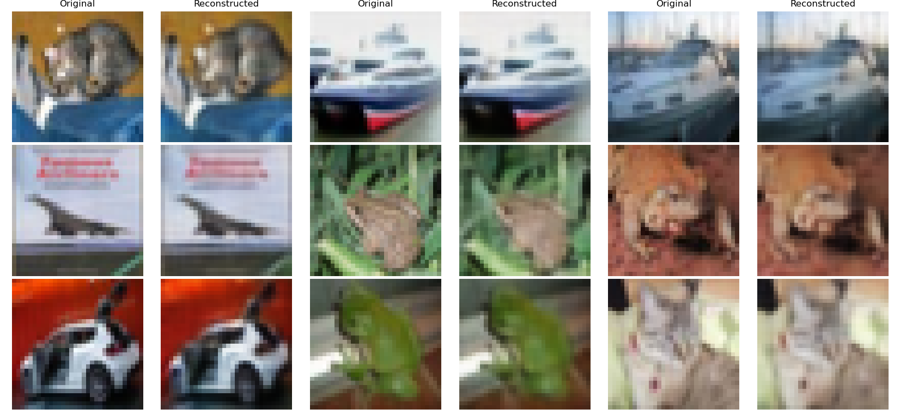

# Image Autoencoder

This project implements a simple convolutional autoencoder built in PyTorch for image reconstruction and learned compression. The objective was to build a simple, flexible framework that can be easily adapted to different tasks. The architecture supports customizable encoder and decoder depths, latent dimensionality, and downsampling/upsampling strategies for easy tuning of model capacity and bottleneck strength. This flexibility makes it reusable not only for evaluating reconstruction quality and compression performance, but as a building block for more advanced models.

Due to compute limitations, CIFAR-10 images are used as the dataset. As an example application, the model was trained to achieve a 4:1 compression ratio by controlling latent dimensionality and is compared to a common standard like JPEG (with quality adjusted to produce comparable compression) in the following table:

| Dataset                 | MSE     | PSNR  | SSIM   | Compression Ratio |
| ----------------------- | ------- | ----- | ------ | ----------------- |
| **Autoencoder (Train)** | 0.00085 | 30.77 | 0.9515 | 4.00              |
| **Autoencoder (Val)**   | 0.00079 | 31.09 | 0.9526 | 4.00              |
| **JPEG (Average)**      | 0.00143 | 28.93 | 0.9098 | 3.61              |

The model performs slightly better than JPEG (at the cost of increased computation), providing the potential for more detailed reconstructions and, importantly, access to a latent space that can be leveraged for downstream tasks.  

A few example original/reconstructed image pairs are shown below:

The codebase also includes early support for extensions such as variational encoding and perceptual loss (e.g., LPIPS), though these are not currently used in the main experiments.

